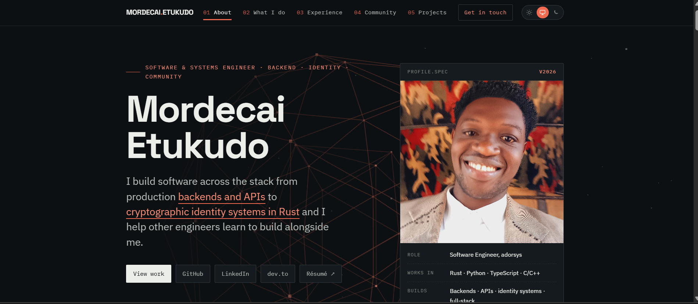

# Personal Portfolio

Mordecai Etukudo's personal portfolio site.

Live: [martcpp.github.io](https://martcpp.github.io)

## Preview

<p align="center">
  <kbd>
    <a href="https://martcpp.github.io/" target="_blank"></a>
  </kbd>
</p>

## Features

- Fully responsive, plain HTML/CSS/JS, no build step
- Light, dark, and system theme toggle with no flash on load
- Rotating 3D wireframe lattice in the hero, built with Three.js
- Ferris vs Python "duel" illustration, animated with pure CSS
- Scroll reveal and active section highlighting in the nav

## Project structure

```
index.html
assets/
  css/style.css     site styles
  js/main.js        theme toggle, mobile menu, scroll reveal, hero animations
  img/              images and favicons
  resume/           resume PDF
```

## Sections

- About
- What I do
- Experience
- Speaking & Community
- Projects
- Writing & Talks
- Skills
- Education
- Contact

## Running locally

Serve the folder with any static file server, for example:

```
python -m http.server 8000
```

Then open `http://localhost:8000`.

## Deployment

Hosted on GitHub Pages, served from the root of this repository.
